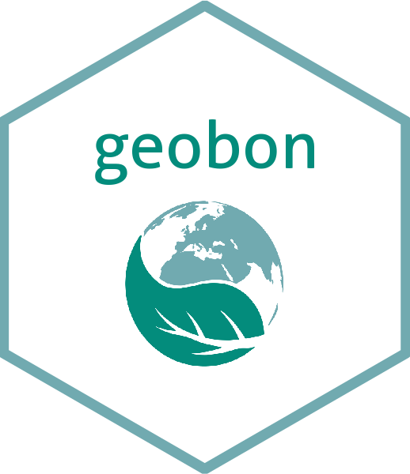

<!-- README.md is generated from README.Rmd. Please edit that file -->

# rgeobon 

<!-- badges: start -->

[](https://www.tidyverse.org/lifecycle/#experimental)
[](https://opensource.org/licenses/MIT)
[](https://github.com/VLucet/geobon/actions)
<!-- badges: end -->

The goal of rgeobon is to provide an interface between R and the [GEOBON
open data portal](https://portal.geobon.org/) RESTfull API (please note
that the portal is currently in beta). It allows to consult the datasets
available on the portal and download them.

## Installation

You can install rgeobon from GitHub:

``` r
devtools::install_github("vlucet/rgeobon")
```

## Example

This demonstrates the basic abilities of `rgeobon`. You can first get
the list of all the available datasets:

``` r
library(rgeobon)
# Get the list of GEOBON datasets
dataset_list <- geobon_list()
dataset_list
#> # A tibble: 6 x 33
#>   id    title publication_date environmental_d… provenance_desc… license doi  
#>   <chr> <chr> <chr>            <chr>            <chr>            <chr>   <lis>
#> 1 1     Chan… 2018             Terrestrial      To be added soon CC BY … <chr…
#> 2 2     Fore… 2019             Terrestrial      To be added soon CC BY … <chr…
#> 3 3     Pred… 2016             Terrestrial      To be added soon CC BY … <chr…
#> 4 4     Rela… 2020             Terrestrial      To be added soon CC BY … <chr…
#> 5 5     Mamm… 2020             Terrestrial      To be added soon CC BY … <chr…
#> 6 10    Glob… 2020             Terrestrial, Ma… To develop the … CC BY … <chr…
#> # … with 26 more variables: external_link <list>, description <chr>,
#> #   keywords <list>, additional_info <chr>, path_name_dataset <chr>,
#> #   path_name_metadata <chr>, creator_creator_name <chr>,
#> #   creator_creator_organisation <chr>, creator_creator_email <chr>,
#> #   contact_contact_name <chr>, contact_contact_organisation <chr>,
#> #   contact_contact_email <chr>, ebv_ebv_class <chr>, ebv_ebv_name <chr>,
#> #   spatial_domain_spatial_extent <chr>,
#> #   spatial_domain_spatial_description <chr>,
#> #   spatial_domain_spatial_resolution <chr>,
#> #   spatial_domain_spatial_accuracy <chr>,
#> #   temporal_domain_temporal_resolution <chr>,
#> #   temporal_domain_temporal_extent_start <chr>,
#> #   temporal_domain_temporal_extent_end <chr>,
#> #   biological_entity_entity_type <chr>,
#> #   biological_entity_taxonomic_coverage <chr>,
#> #   biological_entity_classification_classification_system_name <chr>,
#> #   biological_entity_classification_classification_system_type <chr>,
#> #   biological_entity_classification_classification_system_reference <chr>
```

From here, you can request information on a single record, and download
the data associated with this record, if any is available.

``` r
# List possible ids
dataset_list$id
#> [1] "1"  "2"  "3"  "4"  "5"  "10"

# Get a specific record
geobon_get(id = 1)
#> # A tibble: 1 x 33
#>   id    title publication_date environmental_d… provenance_desc… license doi  
#>   <chr> <chr> <chr>            <chr>            <chr>            <chr>   <lis>
#> 1 1     Chan… 2018             Terrestrial      To be added soon CC BY … <chr…
#> # … with 26 more variables: external_link <list>, description <chr>,
#> #   keywords <list>, additional_info <chr>, path_name_dataset <chr>,
#> #   path_name_metadata <chr>, creator_creator_name <chr>,
#> #   creator_creator_organisation <chr>, creator_creator_email <chr>,
#> #   contact_contact_name <chr>, contact_contact_organisation <chr>,
#> #   contact_contact_email <chr>, ebv_ebv_class <chr>, ebv_ebv_name <chr>,
#> #   spatial_domain_spatial_extent <chr>,
#> #   spatial_domain_spatial_description <chr>,
#> #   spatial_domain_spatial_resolution <chr>,
#> #   spatial_domain_spatial_accuracy <chr>,
#> #   temporal_domain_temporal_resolution <chr>,
#> #   temporal_domain_temporal_extent_start <chr>,
#> #   temporal_domain_temporal_extent_end <chr>,
#> #   biological_entity_entity_type <chr>,
#> #   biological_entity_taxonomic_coverage <chr>,
#> #   biological_entity_classification_classification_system_name <chr>,
#> #   biological_entity_classification_classification_system_type <chr>,
#> #   biological_entity_classification_classification_system_reference <chr>

# Download the data from that record into a temp directory
geobon_download(id = 1, path = tempdir())
```
